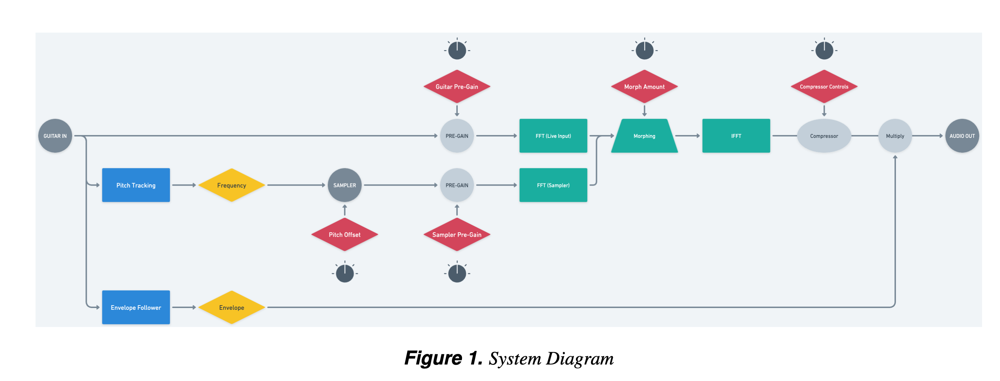

# SpectralMorphingPedal

#### Video Demo: https://www.youtube.com/watch?v=IqTfSJJCxtA&list=PL4widt4EFIHcix-wPnhlElrksZj2lt3cM&index=5

## Overview and Prerequisites
The SpectralMorphingPedal is an embedded audio processing application designed for the Bela platform, focusing on real-time manipulation of audio signals to perform spectral morphing. This application integrates various digital signal processing components, such as a sampler, envelope follower, pitch tracker, spectral morpher, and compressor, to give the user the ability to spectrally morph the input signal with a set of samples. The samples have been omitted from this repository due to space constraints.

**Prerequisites:**
- **Knowledge of C++:** Understanding basic to intermediate C++ concepts is essential for navigating and modifying the application code.
- **Familiarity with the Bela Platform:** Experience with setting up and running projects on Bela, including using its IDE and accessing GPIOs for custom controllers.
- **Digital Signal Processing Fundamentals:** A grasp of basic DSP concepts, including FFT, filtering, and dynamics processing, will help in understanding how the application processes audio.

### render.cpp Documentation

#### Overview
`render.cpp` serves as the primary entry point for the SpectralMorphingPedal application on the Bela platform. It orchestrates interactions between key DSP components to process real-time audio input and generate modified audio output based on user-defined parameters.

#### Setup Function
```cpp
bool setup(BelaContext *context, void *userData);
```
- Initializes the application, including loading audio samples, configuring DSP components, and setting up the graphical user interface (GUI).

#### Render Function
```cpp
void render(BelaContext *context, void *userData);
```
- Acts as the core audio processing loop, invoked for each block of audio frames by the Bela system.

#### Cleanup Function
```cpp
void cleanup(BelaContext *context, void *userData);
```
- Releases resources when the application terminates.

#### Key Components and Functionality
- **Sampler:** Manages loading and playback of audio samples with pitch shifting.
- **Envelope Follower:** Analyzes the amplitude envelope of incoming audio.
- **Pitch Tracker:** Real-time estimation of incoming audio signal's pitch.
- **Morph:** Spectral morphing between live input and loaded sample.
- **Compressor:** Dynamic range compression of the processed audio signal.
- **GUI:** Real-time parameter control via a web interface.
- **Auxiliary Tasks:** CPU-intensive tasks (pitch tracking, FFT) are offloaded to maintain real-time performance.

#### DSP Flow
1. **Input Processing:** Live input.
2. **Pitch Tracking:** Real-time pitch tracking to set pitch of samples.
3. **Sample Playback:** Pitch-shifted sample playback in sync with live input.
4. **Spectral Morphing:** Live input and sample are morphed based on user settings.
5. **Envelope Following:** Modulates output signal dynamically with input's amplitude envelope.
6. **Compression:** Controls output signal's dynamic range before final output.

#### System Diagram


#### Control Parameters
- **Morph Amount:** Blend between live input and sampled audio.
- **Guitar Gain:** Gain level of guitar input.
- **Sampler Gain:** Gain level of sampled audio.
- **Pitch Offset:** Pitch shifting of sampled audio.
- **Compression Settings:** Threshold, ratio, and makeup gain for dynamic range control.

#### Usage
Designed for the Bela platform, this application leverages real-time DSP for live performance and experimentation. GUI sliders enable interactive control over audio processing parameters. This is a simple prototype and when fully implemented, would integrate physical hardware to control system parameters.

#### Acknowledgements

The Morph class was adapted from Andrew McPherson’s Phase Vocoder examples from his series Real-Time Audio Programming with Bela.

The PitchTracker was adapted from Alain de Cheveigné and Hideki Kawahara's YIN algorithm.

This project was completed for the Music and Audio Programming Course at Queen Mary University of London, instructed by Adan Benito Temprano.
